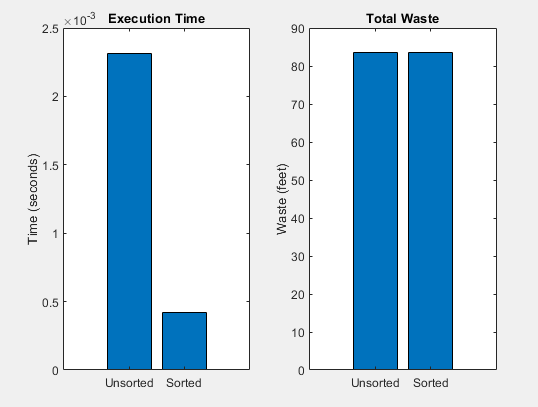

# Cutting_Stock_Problem
## ICSI-499 Project Cutting Stock Problem

Team No. 4
Wyatt Bushman, Thomas Dalbavie, Michael Lindemann, Chris Nunez
Project Name: Cuttinbg Stock Calculator
Built by Peter LLC.
Milestone 2

### 1. Introduction:
The goal of this project is to: research, implement, and iterate on a desktop software solution for the “cutting stock problem.”A problem we believe to be closely related to the “bin packing problem,” which is classified as a strongly NP-hard problem [1]-[2]. Solving this problem would aid in waste minimization of wood sheet stock by making the most use of the available sheet stock[1]. This would have in-turn, have a cascading effect across multiple industries not just limited to lumber and construction, as well as aid in preservation of resources, automation, and efficiency.   

### 2. Description:
#### 2.1 What Problem are we trying to solve?
The problem is known as the “cutting stock problem,” also referred to as the “stock-size selection problem,[1]. We are trying to create approximate algorithms to reduce wood waste. The plan is to iterate on existing software solutions, built by the sponsor, which already implements an incomplete cutting stock algorithm built in Unreal Engine [10]. The reason for using Unreal Engine is arbitrary, and can be ported to another framework, which will likely be the case since Unreal Engine export to HTML5 ceased after Unreal Engine 4.23. [11], [12]. Our solution will focus only on a 2D plane.

#### 2.2 Why is this an important problem?
This problem hasn’t been solved, and that by itself is why it is important. In terms of the world at large, it would serve as a cost saving measure for industrial wood cutting and construction, reduce human work load and increase safety by having machines be automated to cut boards optimally, and potentially reduce impact on the environment by reducing waste [2]. Vaidya et al. (2016) stated that “Yields are rarely above 25% in the timber processing value chain from sawmilling to the end product and without including felled timbers in the forests.”[3] Helping to develop an algorithm that can reduce waste will have benefits in the timber industry which in-turn can benefit other industries that depend on timber. 

#### 2.3 How is this a challenging problem?
It is classed as an NP-Hard difficulty, similar to the bin packing problem which by definition is a challenging problem [1]. Our problem introduces a few additional conditions to the bin packing problem. This includes the ability to rotate pieces and ensure adequate space between “bins” is available to account for wood saw blade thickness. We also have the requirement that the cuts have to be made from one side of a wood piece to another, also known as “Guillotine cuts.” [10]

### 3. Comparison With Existing Solutions:
#### 3.1 What Are Existing Solutions?

Our goal is to reduce waste and bin packing wishes to achieve the same goal by maximizing the available space. There is continual research in the field of bin packing and cutting stock problems with already proposed solutions. In regards to bin packing, there are 3 commonly known solutions known as: shelf, guillotine, and maximal rectangle algorithms [9].

The shelf algorithm, as the name suggests divides the available space into fixed height shelves and then places a rectangle unit that’s height does not exceed the height of the shelf [9]. This solution appears to be the simplest and is considered the least computationally intensive option of the three known solutions, but comes with the most waste [9] 

The guillotine algorithm is considered an improvement of the shelf algorithm, but at the cost of being more computationally intensive. It places a rectangle unit in the lower left hand corner of the available space, and then proceeds to subdivide in an L-shape pattern. If the next unit is too big for one box, it is placed in the other if possible. This division is done recursively until the space is fully occupied or the incoming units cannot fit into the space [9].  

The maximal rectangle algorithm is considered a greedy solution and can be considered a further improvement of the guillotine algorithm, but is the most computationally intensive of the three known solutions. The key difference is overlapping available space by merging subdivides, once the division occurs you can compare the merge spaces with the prior available spaces for the best placement of a rectangle unit [9]. 

### 3.2 What new things are we doing?

Algorithm Design
Dynamic Programming Approach
Implement a dynamic programming algorithm to minimize waste by optimizing the arrangement of rectangles within the given material constraints
Ensure our algorithm provides an efficient solution within a reasonable timeframe, even with increasingly large problem sets
Enable switching between different algorithms to compare waste output and identify the most effective approach
Guillotine Cuts
Horizontal or vertical cuts from one side of the canvas to the other, allows for more efficient and user-friendly solutions
User Interface Development
Gather User Input
Create an intuitive interface for users to input dimensions and types of materials.
Allow users to define the width for 1D items (2x4’s) and the length and width for any 2D canvas (plywood)
Output Visuals
Visual of canvases with the rectangles arranged upon them in an optimal layout
Deployment
Deploy the application for external users to access, ensuring it is user-friendly and practical for industry use

### 4. Requirements Specification:
#### 4.1 User Classes and Functional Requirements
Construction Industry Professionals:
Functional requirements 1.1: Input Definitions
Input multiple canvas sizes based on standard wood sizes from suppliers.
Precise saw blade thickness entry for industrial-grade saws.
Allow the use of different systems of measurement for flexibility (Imperial or Metric).
Functional requirement 1.2: Output and Visualization
Generate professional-grade visual layouts for use with industry tools like CNC machines.
Hobbyists/DIY Enthusiasts:
Functional requirements 2.1: Simple Input Definition
Support easy input for custom or leftover canvas and plank sizes. 
Default canvas, plank, and saw blade thickness options based on common sizes available to individual consumers.
Functional requirement 2.2: Waste Minimization
Allows users to add custom canvas sizes to enable them to use leftover wood and save money.
Functional requirement 2.3: Output and Visualization
Makes easy to understand visual layouts that allow for easy-to-follow cutting plans. Include simple tips for cutting appropriately.
Manufacturers/Pre-fabricators:
Functional requirement 3.1: Bulk Input for Large Orders.
Support bulk input of canvas and plank sizes for large scale operations.

#### 4.2 Non-functional Requirements
Performance: Due to the nature of the algorithm, as more inputs are created, the amount of possibilities for arrangement become exponentially large. This is something that needs to be overcome since brute force requires far too much processing power. Some set of assumptions or guesses should be made to achieve the most accurate possible combination.
Accuracy: Given the large amount of possibilities to sort, it is not realistic to search each one of those. Some form of compromises need to be made in order to account for the potentially large scale of combinations. This means that the guesses or assumptions made by the algorithm are sound and reduce the waste as much as possible.
Scalability: The algorithm should be able to handle an increased amount of blocks and canvases without any significant slowdowns.
Flexibility: The user should be able to adjust different parameters. Such parameters include the user’s blade thickness, canvas sizes available to them, and what sized wood pieces the user wants.
Usability: The user interface should be intuitive and easy to work with. The user should easily be able to add, adjust, or remove parameters. This will make it easy for the user to adapt based on potentially changing situations such as the saw they have available at the time.
Waste Minimization: The algorithm should sort the wood to the best of its ability to take up as much space as possible on a canvas. If a canvas is too large for what is remaining it should be able to adjust and pick a smaller canvas if available.

#### 4.3 Operating Requirements

Internet: needed to access web tool webpage
Web Browser: needed to access webpage to download application or use online tool
Desktop PC or Mac to install the application and/or use the web tool. 

#### 4.4 Design and Implementation Constraints
UI interface should be simple and accessible for all users with clear instructions
Version control will be using GitHub 
Project will iterate on an existing Unreal Engine application and be export as a webGL application and have a direct download option 
Code must be well documented 
Commits will have good messages
Issues will be tracked on GitHub issues

### 5. References:

[1] E. S. Kokten and C. Sel, “A cutting stock problem in the wood products industry: A two-stage solution approach,” International Transactions in Operational Research, vol. 29, no. 2, pp. 879–907, 2022. [Online]. Available: https://tinyurl.com/ytmnm482.

[2]T.-H. Nguyen and X.-T. Nguyen, "Space Splitting and Merging Technique for Online 3-D Bin Packing," Mathematics, vol. 11, no. 8, Apr. 2023. [Online]. Available: https://tinyurl.com/5xy3frwy.

[3] A. A. Vaidya, M. Gaugler, and D. A. Smith, “Green route to modification of wood waste, cellulose and hemicellulose using reactive extrusion,” Carbohydrate Polymers, vol. 136, pp. 1238–1250, Jan. 2016. doi: https://doi.org/10.1016/j.carbpol.2015.10.033. [Online]. Available: https://tinyurl.com/3paj6rsr.

[4] Y. Shiomi et al., "The Solution of 2-Dimensional Rectangular Cutting Stock Problem Considering Cutting Process," in 2007 IEEE International Conference on Automation Science and Engineering, Scottsdale, AZ, USA, 2007, pp. 140-145. doi: 10.1109/COASE.2007.4341732. [Online]. Available: https://tinyurl.com/ynhdrjtz.

[5] R. Zhao, T. Liang, Z. Wu, D. van den Berg, M. Thürer, and T. Weise, “Randomized Local Search on the 2D Rectangular Bin Packing Problem with Item Rotation,” in Proceedings of the Genetic and Evolutionary Computation Conference Companion, 2024, pp. 235–238. doi: 10.1145/3638530.3654139. [Online]. Available: https://tinyurl.com/5n7waccx.

[6] A. Neuenfeldt Júnior et al., "The machining torch movement for the rectangular plasma sheet metal cut," PLoS ONE, vol. 18, no. 9, p. e0291184, Sep. 2023. doi: 10.1371/journal.pone.0291184. [Online]. Available: https://tinyurl.com/3s4k48ty.

[7] X. Zhao et al., "An efficient constructive heuristic for the rectangular packing problem with rotations," PLoS ONE, vol. 18, no. 12, p. e0295206, Dec. 2023. doi: 10.1371/journal.pone.0295206. [Online]. Available: https://tinyurl.com/2xc2e5wb.

[8] L. Ribeiro and A. A. Ananno, "A Software Toolbox for Realistic Dataset Generation for Testing Online and Offline 3D Bin Packing Algorithms," Processes, vol. 11, no. 7, Jun. 2023. doi: 10.3390/pr11071909. [Online]. Available: https://tinyurl.com/yck4zmn5.

[9] N. Ram, “Optimizing E-commerce: Solving the Bin Packing Problem,” Medium, Apr. 14, 2023. [Online]. Available: https://tinyurl.com/d7mdmkbk.

[10] P. Buonaiuto, Existing Work. [Source code]. Holbrook, NY: Built By Peter LLC., 20XX.

[11] UnrealEngineHTML5, “GitHub - UnrealEngineHTML5/Documentation,” GitHub, 2019. https://github.com/UnrealEngineHTML5/Documentation (accessed Sep. 15, 2024). [Online]. Available:https://tinyurl.com/yutvrdm4

[12] “HTML5 support ?,” Epic Developer Community Forums, May 21, 2023. https://forums.unrealengine.com/t/html5-support/1172997/2 (accessed Sep. 15, 2024).[Online]. Available:https://tinyurl.com/mr4826ha

### Dev Log/Notes:

Speed of sorting algorithm for 1D problem using 100,000 random inputs.

Unsorted Speed: 2.4 seconds
Sorted Speed: 0.4 seconds

Factor of speed increase 2.4/0.4 = 6

Percent increase = ((Factor - 1)/1) * 100 = 500% increase in speed

Sorting speed increase is 500% increase

I didn't know where to put this but here's where I got the cute icon(https://www.freepik.com/icon/circular-saw_2766057#fromView=search&page=6&position=74&uuid=c6a13b56-118a-4e61-977a-93050731615f)

‌

